<!--
  프로필 README  ·  저택 서재
  assets/scene.svg     : 배경 전체 장면 (벽 + 책장 + 책 + 바 카운터 + 캐릭터 자리)
  assets/books.svg     : "책" 클릭용 썸네일
  캐릭터 그림이 나오면 scene.svg 의 character slot 자리에 삽입하고,
  맨 아래 CHARACTER 주석 블록을 풀어 두 칸 표로 바꾸면 됨.
  지글거림(WigglyPaint 스타일)은 SVG 안에서 재생됨. JS 없음.
  언어 블록은 KO / EN 주석으로 구분 — 나중에 영어 추가 대비.
-->

  

<!-- KO -->
<h2 align="center">늦은 밤의 서재 &nbsp;·&nbsp; the late study</h2>

<i>벽난로는 등 뒤에 있습니다. 촛불 하나로 충분한 밤.</i>

  

  

   

  **📚 책장에서 / on the shelf**

  - 요즘 읽는 책 — *제목*
  - 다시 꺼내보는 책 — *제목*
  - 추천 — [링크](https://example.com)

  

<!-- CHARACTER : 캐릭터 그림 완성되면 이 블록을 풀어 위 책 카드와 나란히 두 칸 표로 배치

<table><tr>
<td>

 ... 
</td>
<td>

  

  🕯️ 서재 주인 / behind the bar

  - 이름 · 한 줄 소개
  - 쓰는 것 · 언어 / 툴
  - 연락 · 이메일

  

</td>
</tr></table>

-->

SVG 손그림이 WigglyPaint처럼 계속 꿈틀댑니다 · 클릭 상호작용은 위 책 카드의 펼치기

